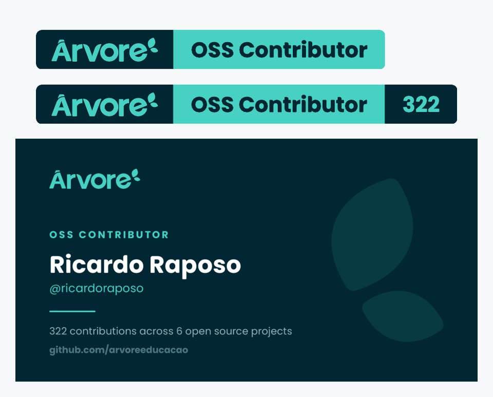

# Árvore OSS Badge

A small site where anyone who contributed to [Árvore's open source
projects](https://github.com/orgs/arvoreeducacao/repositories?type=source) can
pick up their own badge and share card. One badge, no tiers: anyone with a
landed contribution wears the same mark.

**https://oss.arvore.com.br**

<p align="center">
  
</p>

Everything here is generated. The wordmark and the leaf mark are the real
vectors from the Árvore design system, and every piece of text is baked into
paths at build time, so there are no web fonts and no external requests: the
artwork renders identically on GitHub, on LinkedIn and anywhere else it lands.

## What a contributor gets

Open the site, search for your handle and the panel hands you three things:

- **The badge**, 20 pixels tall and flat styled, so it lines up with shields.io
  badges in the same row. Copy it as Markdown, as HTML or as a plain image
  address.
- **The badge with your contribution count**, same artwork with a third segment.
- **A 1200x630 card**, sized for LinkedIn, X and Open Graph previews, with a
  download button.

Every contributor also has a permanent link, `…/#/YOUR_HANDLE`, that opens
straight on their panel.

## Using the shared badge without visiting the site

```markdown
[](https://github.com/arvoreeducacao)
```

Personal badges follow the same shape:

```
badges/contributors/YOUR_HANDLE.svg
cards/YOUR_HANDLE.png
```

There is also a shields.io endpoint file per person, for anyone who would
rather have shields render the badge:

```markdown

```

GitHub caches images through its own proxy, so a fresh count can take a few
hours to show up in a README.

## How the roster is built

`node src/cli.js refresh` walks every public, non-fork, non-archived repository
in the `arvoreeducacao` organization, reads each repository's contributor list,
sums the contributions per person and drops bots. The result lands in
`contributors.json`, and the badges, cards, endpoint files and `index.html` are
regenerated from it.

The scheduled workflow in `.github/workflows/refresh.yml` runs this weekly and
commits whatever changed. Nothing to host and nothing to keep alive: the site
and the artwork are static files served by GitHub Pages straight from `main`.

## Build it locally

```bash
npm install
node src/cli.js build                                    # shared badge and the site
GITHUB_TOKEN=$(gh auth token) node src/cli.js refresh     # scan the org, rebuild everything
python3 -m http.server 8899 --bind 127.0.0.1              # then open http://127.0.0.1:8899
```

`ARVORE_ORG` overrides the organization to scan and `SITE_BASE_URL` overrides
the absolute address baked into the copy-paste snippets.

## Publishing

The site is a folder of static files on Vercel, under the Árvore team, at
`oss.arvore.com.br`. There is no build step: Vercel serves the repository root.
Every push to `main` deploys, so the weekly refresh commit publishes itself.

## Licensing

The code is MIT. The Árvore wordmark and leaf mark are trademarks: contributors
may display this artwork unmodified to say they contributed, and any other use
needs written permission. The fonts are SIL OFL 1.1. See [LICENSE](LICENSE).
